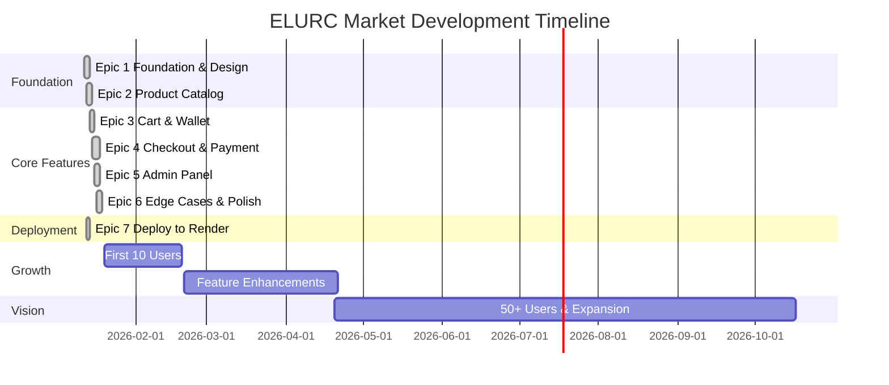

# 🛒 ELURC Market

<div align="center">


[](LICENSE)
[](/_bmad-output/planning-artifacts/prd.md)
[](#roadmap)

**Territorial Currency E-Commerce for Bretaigne's Economic Sovereignty**

*The first organic grocery marketplace exclusively powered by ELURC cryptocurrency*

🚀 **[Live Demo on Render.com](https://elurc-shopping.onrender.com)** 🚀

[Features](#-features) • [Tech Stack](#-tech-stack) • [Roadmap](#-roadmap) • [Getting Started](#-getting-started)

</div>

---

## 🌟 Overview

ELURC Market is a groundbreaking e-commerce platform that proves cryptocurrency can power everyday commerce. Built for Bretaigne's ELURC community, this platform enables users to purchase organic groceries using only ELURC—no euros, no banks, no permission.

### 🎯 Vision

Building economic infrastructure for territorial sovereignty. ELURC Market demonstrates that local currencies can facilitate real commerce for essential goods, creating a closed-loop economy that keeps wealth within the community.

### ✨ Innovation

- **ELURC-Only Payments**: Exclusive territorial currency model
- **Wallet-Based Auth**: No traditional accounts—just connect your Phantom wallet
- **Blockchain-Native**: Built on Solana for fast, reliable transactions
- **Mobile-First**: QR code payments optimized for crypto-native UX

---

## 🚀 Features

### MVP (Phase 1) - *Complete - Ready for Deployment*

- [x] Product catalog with categories (Fresh, Dry)
- [x] Shopping cart functionality
- [x] Phantom wallet integration
- [x] QR code payment generation
- [x] Real-time payment monitoring (Solana blockchain)
- [x] Transaction validation & confirmation
- [x] Email notifications
- [x] Order management dashboard
- [x] Inventory tracking (PayloadCMS)
- [x] Admin panel with authentication
- [x] Overpayment/underpayment detection
- [x] **Deployment to Render.com (Epic 7 - Complete)**

### Growth (Phase 2) - *Planned*

- [ ] Real-time inventory updates
- [ ] Telegram feed integration
- [ ] Advanced filtering & search
- [ ] Analytics dashboard
- [ ] Product reviews & ratings
- [ ] Customer order history

### Vision (Phase 3) - *Future*

- [ ] DAO integration for NFT holders
- [ ] Multi-vendor marketplace
- [ ] Native mobile app (iOS/Android)
- [ ] Smart contract automation
- [ ] Cross-border ELURC commerce

---

## 🛠️ Tech Stack

### Frontend


### Backend & CMS


### Blockchain


### Database & Deployment


---

## 📊 Roadmap



### 🎯 Success Metrics

| Metric | 3 Months | 12 Months |
|--------|----------|-----------|
| Active Users | 10 | 50 |
| Transaction Volume | Growing | Established |
| Payment Detection | 100% | 100% |
| Cart Completion Rate | 25% | 35%+ |

---

## 🏁 Getting Started

### Prerequisites

- Node.js 18+ and Yarn
- Phantom wallet (for testing)
- Prisma account (for database)
- Solana RPC access

### Installation

```bash
# Clone the repository
git clone https://github.com/Huaoe/elurc-shop.git
cd elurc-shop/payload-test

# Install dependencies
yarn install

# Set up environment variables
cp .env.example .env.local
# Edit .env.local with your configuration

# Run Prisma migrations
npx prisma migrate dev

# Run Next.js development server
yarn dev
```

### Environment Variables

```env
# Database (Supabase)
DATABASE_URL=your_supabase_connection_string

# PayloadCMS
PAYLOAD_SECRET=your_secret_key

# Solana
NEXT_PUBLIC_SOLANA_RPC_URL=your_rpc_url
NEXT_PUBLIC_SHOP_WALLET=your_shop_wallet_address
NEXT_PUBLIC_ELURC_TOKEN_ADDRESS=your_elurc_token_address

# Email (Resend)
RESEND_API_KEY=your_resend_api_key
FROM_EMAIL=noreply@yourdomain.com

# Conversion Rate
NEXT_PUBLIC_ELURC_EUR_RATE=0.10
```

---

## 📖 Documentation

- **[Product Requirements Document](/_bmad-output/planning-artifacts/prd.md)** - Complete PRD with 50 FRs, 67 NFRs
- **[Architecture Document](/_bmad-output/planning-artifacts/architecture.md)** - Complete architecture decisions and patterns
- **[Epic Breakdown](/_bmad-output/planning-artifacts/epics.md)** - Complete epic and story breakdown
- **[Sprint Status](/_bmad-output/implementation-artifacts/sprint-status.yaml)** - Current development status
- **[Brainstorming Session](/_bmad-output/analysis/brainstorming-session-2026-01-12.md)** - Initial ideation and vision

---

## ⏱️ Project Time Tracking

**Git Statistics** | *Last Updated: 2026-01-13 18:16*

| Metric | Value |
|--------|-------|
| **Project Start** | Jan 12, 2026 10:26 |
| **Latest Commit** | Jan 13, 2026 18:16 |
| **Development Duration** | 1.5 days (32 hours) |
| **Active Days** | 2 days |
| **Total Commits** | 30 commits |
| **Files Changed** | 324 files |
| **Lines Added** | 52,481+ insertions |
| **Contributors** | 1 (huaoe) |

### Development Breakdown

**Phase 1: MVP Development** ✅ *Complete*
- Foundation & Design System - Tailwind, Shadcn/UI, Prisma, PayloadCMS
- Product Catalog - Product schema, listing/detail pages, categories (Fresh/Dry)
- Cart & Wallet - Zustand state management, cart UI, Phantom integration
- Checkout & Payment - QR codes, payment monitoring, order tracking
- Admin Panel - Authentication, product/order management, fulfillment
- Edge Cases & Polish - Payment discrepancies, error handling, UX refinements
- Deployment - Render.com setup, SSL, monitoring

**Phase 2: Growth Features** (Planned)
- Real-time inventory updates, advanced search, product reviews
- Analytics dashboard, transaction monitoring
- Telegram integration, customer portal

**Phase 3: Vision Features** (Future)
- DAO integration for NFT holders
- Multi-vendor marketplace
- Native mobile app (iOS/Android)

<details>
<summary><b>📋 Detailed Commit History (Click to expand)</b></summary>

### Day 1 - Jan 12, 2026 (Foundation)
| Time | Commit | Description |
|------|--------|-------------|
| 10:26 | `b0dc4cf` | Initial commit |
| 10:31 | `e32e203` | Root readme presenting the project |
| 12:00 | `9e32130` | Architecture & design documents |
| 14:51 | `bd03162` | Prisma Database Setup |

### Day 2 - Jan 13, 2026 (Core Development)
| Time | Commit | Description |
|------|--------|-------------|
| 08:09 | `6d5a401` | Payload manual install |
| 08:37 | `a1fbd42` | Fresh payload install |
| 08:41 | `2eaaa9c` | Update readme to show project timeline |
| 10:03 | `7c1310c` | **Epic 3**: Stories 3.1 → 3.4 + 6-7 |
| 10:31 | `5df0750` | **Epic 3 completed** |
| 12:12 | `e8fad80` | Story 4-4: Payment monitoring service done |
| 14:33 | `39bf8de` | **Epic 5 done** |
| 15:01 | `c628ad8` | Fix render.com build issue with pnpm |
| 15:13 | `7101d37` | Fix typescript issues for clean build |
| 15:16 | `3d1c6ee` | Fix typescript issues for clean build 2 |
| 15:30 | `f6e53c9` | Fix eslint issues |
| 15:38 | `ccbf080` | Implement refund interface with UI components and tests |
| 15:41 | `c94e1f6` | Add refunds collection with TypeScript types |
| 15:05 | `d2dd719` | Mark refund interface story as complete |
| 16:05 | `1894167` | Add OrderDetailsContent client component |
| 16:06 | `d2dd719` | Mark refund interface story as complete |
| 16:07 | `0e58ac0` | Refactor order details to use polling context |
| 16:34 | `edcb5a1` | Remove root yarn.lock to fix Render deployment |
| 16:38 | `7ae6578` | Update deployment status to complete (4h) |
| 16:41 | `df89af5` | Add --no-immutable flag to yarn install |
| 16:43 | `107bfd6` | Add yarn configuration to disable immutable installs |
| 16:51 | `ee87b49` | Remove expect.skip calls and add refund number generation |
| 16:55 | `72cf5c6` | Add live demo link to README |
| 17:04 | `8a1da1b` | Fix: convert user ID to string in admin auth |
| 17:22 | `23803e0` | Standardize Gantt chart formatting |
| 17:26 | `f14cde9` | Condense project time tracking section |
| 18:16 | `8c83a90` | Refactor: remove max-width constraints for full-width layout |

**Total Development Sessions:** 2 days, 30 commits  
**Peak Activity:** Jan 13 afternoon (15:00-18:16) - 14 commits in 3h 16min

</details>

---

## 🤝 Contributing

We welcome contributions from the ELURC community! Please read our contributing guidelines before submitting PRs.

### Development Workflow

1. Fork the repository
2. Create a feature branch (`git checkout -b feature/amazing-feature`)
3. Commit your changes (`git commit -m 'Add amazing feature'`)
4. Push to the branch (`git push origin feature/amazing-feature`)
5. Open a Pull Request

---

## 🔒 Security

- All connections use HTTPS/TLS 1.3+
- Wallet private keys never exposed client-side
- 100% payment detection reliability
- Transaction validation on Solana blockchain
- WCAG 2.1 AA accessibility compliance

---

## 📝 License

This project is licensed under the MIT License - see the [LICENSE](LICENSE) file for details.

---

## 🌐 Community

- **Telegram**: [ELURC Community](https://t.me/elurc)
- **Twitter**: [@ELURC](https://twitter.com/elurc)
- **Website**: [elurc-market.bretaigne](https://elurc-market.bretaigne)

---

## 💡 About ELURC

ELURC is a territorial currency created on Solana blockchain, designed to support Bretaigne's economic sovereignty. By using ELURC for everyday commerce, we're building an alternative economic system based on local circulation, social trust, and community empowerment.

**Vision**: Platform becomes cornerstone of Bretaigne's responsible governance economy and a model for other territorial currencies worldwide.

---

<div align="center">

**Built with ❤️ by the ELURC Community**

*Proving crypto works for everyday commerce*

[](https://github.com/Huaoe/elurc-shop)

</div>
