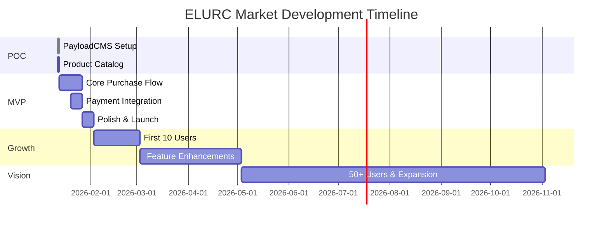

# 🛒 ELURC Market

<div align="center">


[](LICENSE)
[](/_bmad-output/planning-artifacts/prd.md)
[](#roadmap)

**Territorial Currency E-Commerce for Bretaigne's Economic Sovereignty**

*The first organic grocery marketplace exclusively powered by ELURC cryptocurrency*

[Features](#-features) • [Tech Stack](#-tech-stack) • [Roadmap](#-roadmap) • [Getting Started](#-getting-started)

</div>

---

## 🌟 Overview

ELURC Market is a groundbreaking e-commerce platform that proves cryptocurrency can power everyday commerce. Built for Bretaigne's ELURC community, this platform enables users to purchase organic groceries using only ELURC—no euros, no banks, no permission.

### 🎯 Vision

Building economic infrastructure for territorial sovereignty. ELURC Market demonstrates that local currencies can facilitate real commerce for essential goods, creating a closed-loop economy that keeps wealth within the community.

### ✨ Innovation

- **ELURC-Only Payments**: Exclusive territorial currency model
- **Wallet-Based Auth**: No traditional accounts—just connect your Phantom wallet
- **Blockchain-Native**: Built on Solana for fast, reliable transactions
- **Mobile-First**: QR code payments optimized for crypto-native UX

---

## 🚀 Features

### MVP (Phase 1) - *In Development*

- [x] Product catalog with categories (Fresh, Dry)
- [x] Shopping cart functionality
- [x] Phantom wallet integration
- [x] QR code payment generation
- [ ] Real-time payment monitoring (Solana blockchain)
- [ ] Transaction validation & confirmation
- [ ] Email notifications
- [ ] Order management dashboard
- [ ] Inventory tracking (PayloadCMS)

### Growth (Phase 2) - *Planned*

- [ ] Real-time inventory updates
- [ ] Telegram feed integration
- [ ] Advanced filtering & search
- [ ] Analytics dashboard
- [ ] Product reviews & ratings
- [ ] Customer order history

### Vision (Phase 3) - *Future*

- [ ] DAO integration for NFT holders
- [ ] Multi-vendor marketplace
- [ ] Native mobile app (iOS/Android)
- [ ] Smart contract automation
- [ ] Cross-border ELURC commerce

---

## 🛠️ Tech Stack

### Frontend


### Backend & CMS


### Blockchain


### Deployment


---

## 📊 Roadmap



### 🎯 Success Metrics

| Metric | 3 Months | 12 Months |
|--------|----------|-----------|
| Active Users | 10 | 50 |
| Transaction Volume | Growing | Established |
| Payment Detection | 100% | 100% |
| Cart Completion Rate | 25% | 35%+ |

---

## 🏁 Getting Started

### Prerequisites

- Node.js 18+ and Yarn
- Phantom wallet (for testing)
- PayloadCMS account
- Solana RPC access

### Installation

```bash
# Clone the repository
git clone https://github.com/Huaoe/elurc-shop.git
cd elurc-shop

# Install dependencies
yarn install

# Set up environment variables
cp .env.example .env.local
# Edit .env.local with your configuration

# Run PayloadCMS
yarn payload:dev

# Run Next.js development server
yarn dev
```

### Environment Variables

```env
# PayloadCMS
PAYLOAD_SECRET=your_secret_key
DATABASE_URI=your_database_uri

# Solana
NEXT_PUBLIC_SOLANA_RPC_URL=your_rpc_url
NEXT_PUBLIC_SHOP_WALLET=your_shop_wallet_address

# Email
SMTP_HOST=your_smtp_host
SMTP_USER=your_smtp_user
SMTP_PASS=your_smtp_password
```

---

## 📖 Documentation

- **[Product Requirements Document](/_bmad-output/planning-artifacts/prd.md)** - Complete PRD with 50 FRs, 67 NFRs
- **[Brainstorming Session](/_bmad-output/analysis/brainstorming-session-2026-01-12.md)** - Initial ideation and vision
- **[Workflow Status](/_bmad-output/planning-artifacts/bmm-workflow-status.yaml)** - Project tracking

---

## 🤝 Contributing

We welcome contributions from the ELURC community! Please read our contributing guidelines before submitting PRs.

### Development Workflow

1. Fork the repository
2. Create a feature branch (`git checkout -b feature/amazing-feature`)
3. Commit your changes (`git commit -m 'Add amazing feature'`)
4. Push to the branch (`git push origin feature/amazing-feature`)
5. Open a Pull Request

---

## 🔒 Security

- All connections use HTTPS/TLS 1.3+
- Wallet private keys never exposed client-side
- 100% payment detection reliability
- Transaction validation on Solana blockchain
- WCAG 2.1 AA accessibility compliance

---

## 📝 License

This project is licensed under the MIT License - see the [LICENSE](LICENSE) file for details.

---

## 🌐 Community

- **Telegram**: [ELURC Community](https://t.me/elurc)
- **Twitter**: [@ELURC](https://twitter.com/elurc)
- **Website**: [elurc-market.bretaigne](https://elurc-market.bretaigne)

---

## 💡 About ELURC

ELURC is a territorial currency created on Solana blockchain, designed to support Bretaigne's economic sovereignty. By using ELURC for everyday commerce, we're building an alternative economic system based on local circulation, social trust, and community empowerment.

**Vision**: Platform becomes cornerstone of Bretaigne's responsible governance economy and a model for other territorial currencies worldwide.

---

<div align="center">

**Built with ❤️ by the ELURC Community**

*Proving crypto works for everyday commerce*

[](https://github.com/Huaoe/elurc-shop)

</div>
